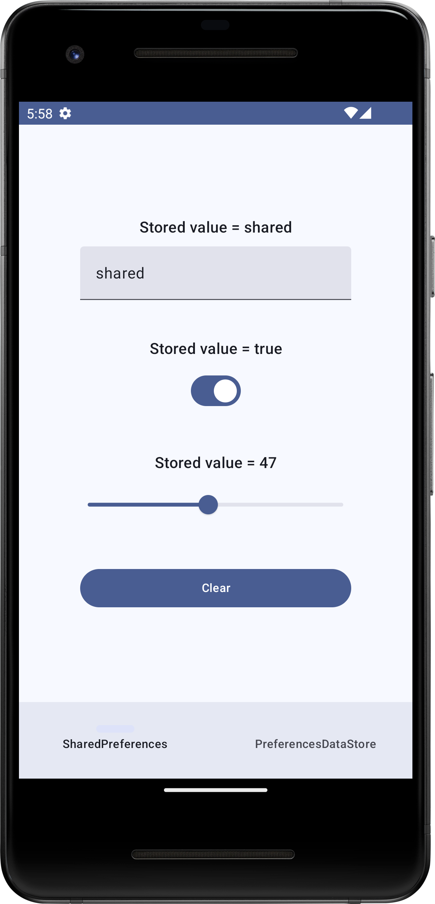
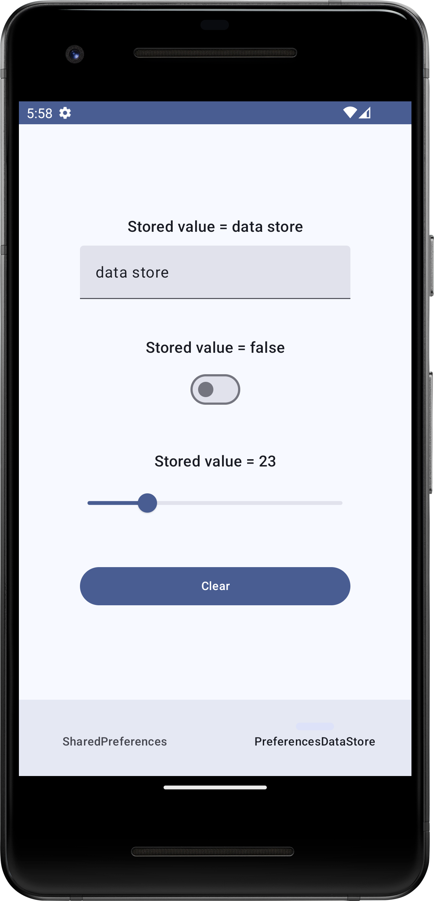

# Fused User Preferences<br />
 [](https://renovatebot.com/)

<p></p>

This is an experimental project that tries to put the legacy SharedPreferences and the new Jetpack
Preferences Datastore side by side by means of dependency inversion to see how it would look if it
were to provide the same preferences storage at the data layer.

<p align="center">
  
  
</p>

## Background

In my first few Android apps, which date back to 2010, we did not have any architecture to follow.
We did not have fragments, so we mostly allocated an activity class for each screen. There, if we
wanted to deal with user preferences, it was so easy that we could have placed the code under
onResume or even onCreated. SharedPreferences is non-blocking, so it works quickly and simply for
most small use cases when it does not break.

- Later, people suggested that SharedPreferences being synchronous can be a problem. That is
  sensible when developers abuse SharedPreferences by storing a massive amount of key pairs.
- Later, people came up with more different architectures, so we are not simply accessing user
  preferences right from the activity class.

Eventually, if we want to access user preferences, we can have many more boilerplate codes before
executing the few lines that do the work.

Now we have Jetpack Preference Datastore. It is asynchronous, which means that when we want to
retrieve user preferences, the result is not immediately available. Up to this moment, if we want to
observe preference changes, there is a known limitation: we are not being told which key pair has
changed. We know only _something_ has changed, so we probably have to propagate _all_ the keys we
are interested in, even if we know that only _one_ has changed.

## The minimum code to make SharedPreferences work

```
private val sharedPref = context.getSharedPreferences(SHARED_PREF_NAME, Context.MODE_PRIVATE)

private val onPreferenceChangeListener = SharedPreferences.OnSharedPreferenceChangeListener { sharedPref, key ->
    when (key) {
        prefKeyString -> {
            _stringPreference.value = sharedPref.getString(prefKeyString, null) ?: stringPreferenceDefault
        }

        prefKeyBoolean -> {
            _booleanPreference.value = sharedPref.getBoolean(prefKeyBoolean, booleanPreferenceDefault)
        }
    }
}

init {
    // If we want to keep track of the changes
    sharedPref.registerOnSharedPreferenceChangeListener(onPreferenceChangeListener)
}

fun getStringPreference() = sharedPref.getString(prefKeyString, null) ?: "default-value"

fun updateStringPreference(newValue: String) {
  try {
      sharedPref.edit()
          .putString(prefKeyString, newValue)
          .apply()
  } catch (e: Throwable) {
      // Not likely to produce exception though
  }
}

```

## The minimum code to make Jetpack Preferences Data Store work

```
private val Context.dataStore: DataStore<Preferences> by preferencesDataStore(name = "preferences")
private val prefKeyStrings:Preferences.Key<String> = stringPreferencesKey("some-key-name")
    
init {
    // assume caller passing in Context.dataStore as DataStore<Preferences>
    externalCoroutineScope.launch(dispatcher) {
        dataStore.data.catch { exception ->
            _preferenceErrors.emit(exception)
        }
            .collect { prefs ->
                // or use map 
                _stringPreference.value = prefs[prefKeyString] ?: stringPreferenceDefault
                _booleanPreference.value = prefs[prefKeyBoolean] ?: booleanPreferenceDefault
                _intPreference.value = prefs[prefKeyInt] ?: intPreferenceDefault
            }
    }
}

suspend fun updateStringPreference(newValue: String) {
    withContext(dispatcher) {
        try {
            dataStore.edit { mutablePreferences ->
                mutablePreferences[prefKeyString] = newValue
            }
        } catch (e: Throwable) {
            _preferenceErrors.emit(e)
        }
    }
}
```

## Approach

Whether for SharedPreferences or Jetpack Preferences Datastore, even if the core is about 10 lines
of code, this code project tries to put them in the right place when following the MVVM and Clean
architecture. That means the UI will talk to the ViewModel, which will then connect to a repository
that invisibly talks to either the SharedPreferences or the Jetpack Preferences Datastore data
store. Dependency inversion with Dagger Hilt allows injecting different data sources (
SharedPreferences and Jetpack Preferences Data Store) into the same repository. Usually in
production apps it is not likely that we have a need to use both sources interchangeably.

## Let's download and run it!

This project was configured to build using Android Studio Iguana | 2023.2.1. You will need to have
Java 17 to build the project.

Alternatively, you can find the ready-to-install APKs and App Bundles under
the [release section](https://github.com/ryanw-mobile/FusedUserPreferences/releases).

## Technical details

### Dependencies

* [JUnit](https://junit.org/junit5/) - EPL 2.0 - A simple framework to write repeatable tests
* [AndroidX Test Ext JUnit](https://developer.android.com/jetpack/androidx/releases/test) - Apache 2.0 - Extensions for Android testing
* [AndroidX Espresso](https://developer.android.com/training/testing/espresso) - Apache 2.0 - UI testing framework
* [AndroidX Lifecycle](https://developer.android.com/jetpack/androidx/releases/lifecycle) - Apache 2.0 - Lifecycles-aware components
* [AndroidX Activity Compose](https://developer.android.com/jetpack/androidx/releases/activity) - Apache 2.0 - Jetpack Compose integration with Activity
* [Jetpack Compose BOM](https://developer.android.com/jetpack/compose/bom) - Apache 2.0 - Bill of Materials for Jetpack Compose
* [AndroidX Core KTX](https://developer.android.com/jetpack/androidx/releases/core) - Apache 2.0 - Extensions to Java APIs for Android development
* [AndroidX Compose UI](https://developer.android.com/jetpack/androidx/releases/compose-ui) - Apache 2.0 - UI components for Jetpack Compose
* [AndroidX Material3](https://developer.android.com/jetpack/androidx/releases/compose-material3) - Apache 2.0 - Material Design components for Jetpack Compose
* [JUnit Vintage Engine](https://junit.org/junit5/docs/current/user-guide/#vintage) - EPL 2.0 - Support for running JUnit 3 and JUnit 4 tests
* [Kotlinx Coroutines Test](https://github.com/Kotlin/kotlinx.coroutines) - Apache 2.0 - Testing libraries for Kotlin coroutines
* [AndroidX DataStore Preferences](https://developer.android.com/jetpack/androidx/releases/datastore) - Apache 2.0 - Data storage solution
* [MockK](https://mockk.io/) - Apache 2.0 - Mocking library for Kotlin
* [Robolectric](http://robolectric.org/) - MIT - A framework that brings fast, reliable unit tests to Android
* [Timber](https://github.com/JakeWharton/timber) - Apache 2.0 - A logger with a small, extensible API
* [Hilt](https://dagger.dev/hilt/) - Apache 2.0 - A dependency injection library for Android that reduces the boilerplate of doing manual dependency injection

### Plugins

* [Android Application Plugin](https://developer.android.com/studio/build/gradle-plugin-3-0-0-migration) - Google - Plugin for building Android applications
* [Jetbrains Kotlin Android Plugin](https://kotlinlang.org/docs/gradle.html) - JetBrains - Plugin for Kotlin Android projects
* [Compose Compiler Plugin](https://developer.android.com/jetpack/compose) - JetBrains - Plugin for Jetpack Compose
* [Ktlint Plugin](https://github.com/JLLeitschuh/ktlint-gradle) - JLLeitschuh - Plugin for Kotlin linter
* [Hilt Android Plugin](https://dagger.dev/hilt/gradle-setup.html) - Google - Plugin for Hilt dependency injection
* [Google DevTools KSP](https://github.com/google/ksp) - Google - Kotlin Symbol Processing API plugin
